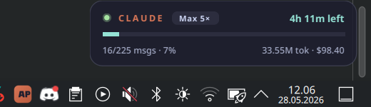

# claude-tray

A small always-on-top HUD for Linux that watches your local Claude Code
transcripts (`~/.claude/projects/**/*.jsonl`) and shows your current
5-hour session status: messages-against-cap, time remaining, tokens, and
estimated cost. Designed for KDE Plasma 6 on CachyOS / Arch.



## Why

Claude Code Pro/Max sessions are a rolling 5-hour window with a soft
message cap. The CLI doesn't surface a "how close am I to the limit"
indicator, so this one parses the transcripts directly and renders a
compact, translucent overlay you can pin to any corner.

Everything is local. No network calls, no API keys.

## Install

Requirements: Python 3.11+ (for `tomllib`), KDE Plasma (or any
SNI-aware tray), an X11 or XWayland session.

```bash
git clone <this-repo> ~/Projects/claude-tray
cd ~/Projects/claude-tray
./install.sh
```

`install.sh` creates a venv, installs PySide6, drops a
`claude-tray.desktop` entry, and enables a `systemd --user` service so
the HUD comes up on every login.

## Config

`~/.config/claude-tray/config.toml`:

```toml
plan = "max5"          # "pro" | "max5" | "max20" | "api"
refresh_seconds = 30
show_cost = true
corner = "br"          # "tl" | "tr" | "bl" | "br"
locked = false
# pos_x / pos_y are written automatically when you drag the HUD
```

Plan determines the message cap shown on the progress bar. The
defaults are Anthropic's published Pro/Max caps as of early 2026 —
adjust the source in `pricing.py` if they change.

After editing config:

```bash
systemctl --user restart claude-tray
```

## Controls

- **Left-drag** the HUD to reposition (saved automatically)
- **Right-click** for a menu: refresh, snap-to-corner, lock, quit
- **Tray icon** toggles the HUD show/hide

## How the counters work

- **Messages**: counts `type="user"` JSONL records that are *real* user
  prompts (not the auto-injected `tool_result` records that the harness
  emits after each assistant tool call). This is what Anthropic's cap
  actually meters.
- **Tokens / cost**: summed from `type="assistant"` records'
  `usage` field. Cost is an estimate using public per-model API
  pricing — accurate if you're paying per token, an "API-rate
  equivalent" if you're on Pro/Max.
- **5-hour window**: starts on the first message in the transcripts;
  a fresh window opens at the next message after a prior window
  expires (matches Claude Code's session semantics).

## Why XWayland?

Wayland forbids clients from setting their own window position — that's
the compositor's call. Corner-pinning a HUD therefore needs either
layer-shell (not yet exposed by Qt) or XWayland. The `main.py` entry
sets `QT_QPA_PLATFORM=xcb` so the app runs under XWayland on Wayland
sessions; KWin still composites and scales it normally.

## Files

```
main.py        entry point (forces QT_QPA_PLATFORM=xcb)
tray.py        QApplication + SNI tray icon + service wiring
overlay.py     the HUD widget (frameless, translucent, draggable)
usage.py       JSONL parser + 5-hour window logic
pricing.py     per-model token rates + plan caps
config.py      TOML config load/save
style.qss      Catppuccin Mocha + CachyOS-teal accent
icon.svg       Claude-orange tray icon
```
